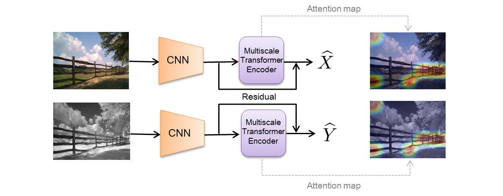

# Paying Attention to Multiscale Feature Maps in Multimodal Image Matching



We propose an attention-based approach for multimodal image patch matching using a Transformer encoder attending to the feature maps of a multiscale Siamese CNN. Our encoder is shown to efficiently aggregate multiscale image embeddings while emphasizing task-specific appearance-invariant image cues. We also introduce an attention-residual architecture, using a residual connection bypassing the encoder. This additional learning signal facilitates end-to-end training from scratch.

## System requirements
* Code was developed and tested on Windows 10.
* 64-bit Python 3.8.5.
* Pytorch 1.7.1 or newer.
* One or more NVIDIA GPUs with 11 GB RAM or more. We used three GeForce GTX 1080 Ti.
* NVIDIA driver 460.89 or newer, CUDA toolkit 11.2 or newer.

## Setup
Install python dependencies using:
```
pip install -r requirements.txt
```

## Datasets
The following datasets are already preprocessed for efficient training:
1. [VisNir]([https://biu365-my.sharepoint.com/:f:/g/personal/kellery1_biu_ac_il/EluR9hiiq3BJgOgmdvYY6RABH0Nr31_CF_lO1QtcBQgt2A](https://biu365-my.sharepoint.com/:f:/g/personal/kellery1_biu_ac_il/EmMhyd3UdKNIr0O8IpAUcJwBgMEYXRJS7lA2WCSk9X15vg?e=yVNVu3)).
2. [En etal]([https://biu365-my.sharepoint.com/:f:/g/personal/kellery1_biu_ac_il/EluR9hiiq3BJgOgmdvYY6RABH0Nr31_CF_lO1QtcBQgt2A](https://biu365-my.sharepoint.com/:f:/g/personal/kellery1_biu_ac_il/EuQ70WqSFLNNk7JjYof0kPIBpblOCiJprqUBzSaT5Rhd8A?e=iBvv7z)).
3. [UBC]([https://biu365-my.sharepoint.com/:f:/g/personal/kellery1_biu_ac_il/EluR9hiiq3BJgOgmdvYY6RABH0Nr31_CF_lO1QtcBQgt2A](https://biu365-my.sharepoint.com/:u:/g/personal/kellery1_biu_ac_il/EfcO4wg0jIFAlJKu5TRhyMYBP-Mpb6buYube1or_zV0guA?e=tCsnTt)).


Re-arrange the test folders with the test datasets containing the appropriate data as follows: test_yos_not, test_lib_yos, test_lib_not, for training on liberty, notredame and yosemite respectively.
## Training
Run the following command:
```
python train.py --dataset-name=visnir --dataset-path=<visnir_downloaded_path>
```

For further configurations run `-h` with the above command.
You may need to set `num_workers` to 0 in the train dataloader when training on UBC, depending on your hardware.
